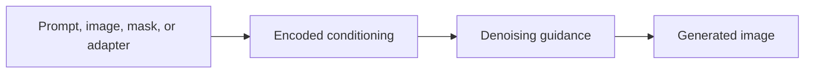

# Conditioning

Conditioning is information used to steer generation. Text prompts are conditioning, but they are not the only kind.

::: tip Quick Take
Conditioning tells the denoising process what to move toward. It can come from text, images, masks, pose maps, depth maps, LoRAs, embeddings, or other controls.
:::

## Conditioning Flow

<!-- diagram id="conditioning-flow" caption="Conditioning flow in a diffusion workflow" -->

## Common Forms

- text prompts
- negative prompts, when supported
- image-to-image inputs
- inpainting masks
- pose, depth, edge, or segmentation maps
- LoRAs and embeddings

::: warning Conditioning Can Conflict
If the prompt, image input, LoRA, and control map ask for different things, the model may compromise, ignore something, or produce artifacts.
:::
