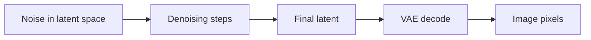

# Latent Space

Latent space is a compressed representation where many modern diffusion workflows operate.

::: tip Quick Take
Latent diffusion usually denoises a compressed representation first, then decodes it into pixels at the end.
:::

## Latent Workflow

<!-- diagram id="latent-workflow" caption="Latent diffusion workflow" -->

Working in latent space can make generation more efficient than operating directly on full-resolution pixels at every step.

::: info VAE Connection
In latent diffusion, the VAE converts between image pixels and latent representations. A mismatched VAE can affect colors, contrast, detail, or artifacts.
:::
