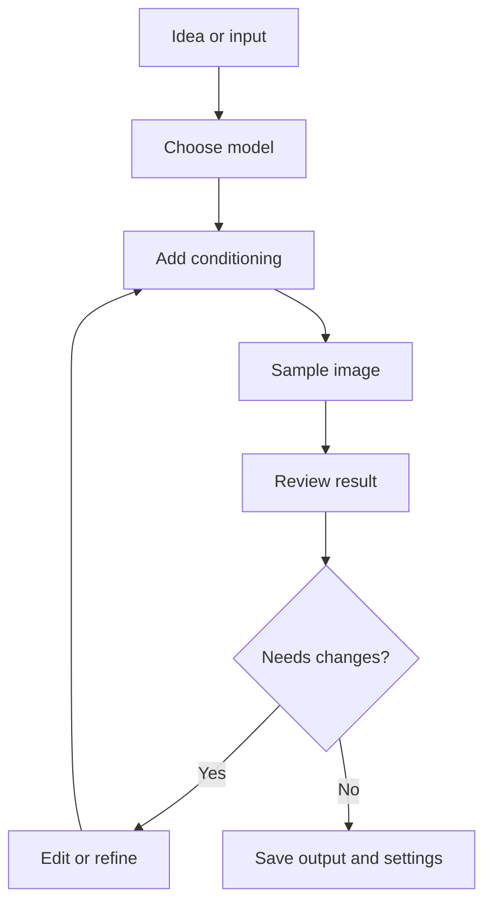

# Workflows

Workflows are repeatable processes for getting from an idea or input image to a useful output. They combine models, conditioning, sampling, editing, and refinement.

::: tip Planned Scope
This section should focus on workflows a reader can actually follow: text-to-image, image-to-image, inpainting, upscaling, ControlNet-style guidance, refinement passes, and multi-stage generation.
:::

## Current Guides

- [Text-To-Image](./text-to-image.md)
- [Image-To-Image](./image-to-image.md)
- [Inpainting](./inpainting.md)
- [Upscaling And Refinement](./upscaling-refinement.md)

## Basic Pipeline

<!-- diagram id="basic-workflow-pipeline" caption="Basic diffusion workflow pipeline" -->

::: warning Change One Major Variable At A Time
If you change the prompt, model, LoRAs, sampler, resolution, and seed all at once, you may get a better image but you will not know why.
:::
