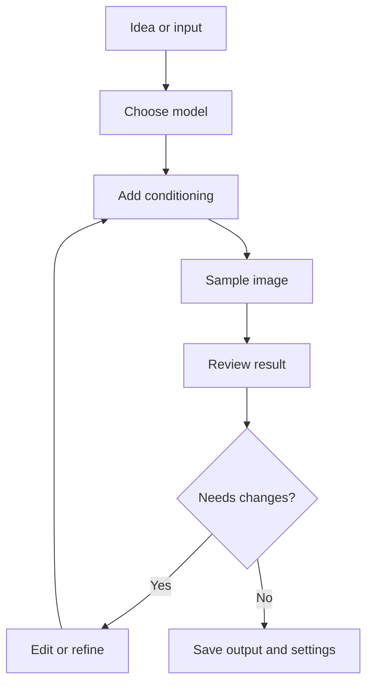

# Workflows

Workflows are repeatable processes for getting from an idea or input image to a useful output. They combine models, conditioning, sampling, editing, and refinement.

::: tip Quick Take
Treat a workflow as a repeatable recipe: inputs, model choices, conditioning, sampling settings, review, edits, and saved metadata. Good workflows make results easier to improve because each change has a clear purpose.
:::

## Workflow Guides

- [Text-To-Image](./text-to-image.md)
- [Image-To-Image](./image-to-image.md)
- [Inpainting](./inpainting.md)
- [Upscaling And Refinement](./upscaling-refinement.md)

## Basic Pipeline

<!-- diagram id="basic-workflow-pipeline" caption="Basic diffusion workflow pipeline" -->

::: warning Change One Major Variable At A Time
If you change the prompt, model, LoRAs, sampler, resolution, and seed all at once, you may get a better image but you will not know why.
:::

## Workflow Parts

Most image-generation workflows include:

- intent: what the image needs to accomplish
- model: the checkpoint or hosted system doing the generation
- conditioning: prompts, masks, images, LoRAs, control maps, or references
- sampling: steps, sampler, scheduler, guidance, seed, and size
- review: selecting candidates and identifying failures
- refinement: inpainting, image-to-image, upscaling, or post-processing
- metadata: saved settings, workflow files, source images, and versions

The more complex the workflow, the more important it is to save state. A good ComfyUI graph, WebUI metadata block, or written recipe can turn a lucky result into a repeatable process.

## Start Simple, Then Add Control

Begin with text-to-image when you are learning a model. Add image-to-image when you need to preserve a composition. Add inpainting when a specific region needs repair. Add upscaling and refinement after the composition is already worth keeping.

Advanced controls such as pose maps, depth maps, regional prompting, and multi-stage node graphs are powerful, but each adds another possible failure point. Add them when they solve a specific problem, not because every workflow needs them.
