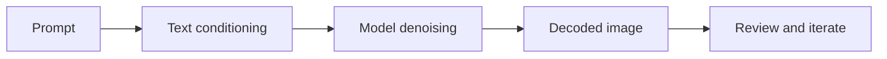

# Text-To-Image

Text-to-image starts from noise and uses a text prompt, model, and sampling settings to produce an image.

::: tip Quick Take
Use text-to-image to learn how a model responds before adding image references, LoRAs, inpainting, or complex workflow nodes.
:::

## Basic Flow

<!-- diagram id="text-to-image-flow" caption="Basic text-to-image workflow" -->

## Practical Steps

1. Choose one model.
2. Write a clear subject and scene prompt.
3. Use conservative default settings.
4. Generate several seeds.
5. Keep the best seed and revise only one major variable.
6. Save the prompt, seed, model, size, sampler, scheduler, and guidance value.

## What To Adjust First

- prompt wording when the subject or composition is wrong
- seed when the idea is right but the composition is weak
- image size when framing or aspect ratio is wrong
- sampler or scheduler only after you understand the baseline

::: info Related Concepts
See [Conditioning](../../concepts/conditioning.md), [Denoising](../../concepts/denoising.md), and [Seeds And Reproducibility](../../concepts/seeds-and-reproducibility.md).
:::
