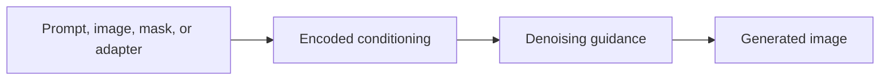

# Conditioning

Conditioning is information used to steer generation. Text prompts are conditioning, but they are not the only kind.

::: tip Quick Take
Conditioning tells the denoising process what to move toward. It can come from text, images, masks, pose maps, depth maps, LoRAs, embeddings, or other controls.
:::

## Conditioning Flow

<!-- diagram id="conditioning-flow" caption="Conditioning flow in a diffusion workflow" -->

## Common Forms

- text prompts
- negative prompts, when supported
- image-to-image inputs
- inpainting masks
- pose, depth, edge, or segmentation maps
- LoRAs and embeddings

## What Conditioning Does

During denoising, the model repeatedly predicts how the current noisy sample should change. Conditioning biases those predictions. A text prompt might bias the model toward "a red chair in a sunlit room"; an inpainting mask might restrict where edits should happen; a pose map might bias the composition toward a body layout.

Conditioning is not a command language. It is a set of signals the model has learned to associate with visual patterns. The model may follow strong, familiar, well-supported signals closely and may weaken, merge, or ignore signals that are vague, contradictory, out of distribution, or unsupported by the model.

## Text Conditioning

Most text-to-image systems convert text into embeddings using one or more text encoders. The diffusion model does not read the prompt as plain English during denoising. It receives encoded representations that carry statistical relationships learned during training.

This has practical consequences:

- word order can matter, but not always like grammar
- rare names, invented terms, or misspellings may tokenize poorly
- different model families can interpret the same prompt differently
- prompt weighting syntax is tool-specific unless the backend implements the same parser
- negative prompts only work when the workflow supports an unconditional or negative conditioning path

## Image And Structural Conditioning

Image inputs provide visual information directly. In image-to-image, the starting image gives the model a structure to transform. In inpainting, the mask tells the workflow which region can change. Control models and adapters may add pose, depth, edges, normal maps, segmentation, reference style, or other structured hints.

These signals can be stronger than text. If a pose map says one thing and the prompt says another, the output may favor the pose map. If the init image is too strong, text changes may barely appear. If the denoising strength is too high, the input image may be overwritten.

## Advanced Detail: Cross-Attention And Guidance

Many latent diffusion models use cross-attention to let image features attend to text-conditioning features while denoising. This is one reason prompts can influence both global composition and local details. LoRAs and related adapters may modify attention layers, feed-forward layers, or other model weights, changing how conditioning is interpreted.

Classifier-free guidance uses a comparison between conditioned and less-conditioned predictions in some workflows. Higher guidance usually pushes harder toward the conditioning difference, but this can also amplify artifacts, harsh contrast, repeated details, or brittle prompt interpretation. See [Classifier-Free Guidance](../theory/classifier-free-guidance.md).

::: warning Conditioning Can Conflict
If the prompt, image input, LoRA, and control map ask for different things, the model may compromise, ignore something, or produce artifacts.
:::

## Troubleshooting Conditioning

When conditioning seems ignored, simplify the workflow:

1. Test one short prompt with no LoRAs, image inputs, or control maps.
2. Keep the same seed and change one conditioning source at a time.
3. Lower overstrong LoRA weights, control weights, or image-to-image strength.
4. Check whether the model family supports the prompt syntax or negative prompt behavior you are using.
5. Save the settings that worked so you can compare future changes.
