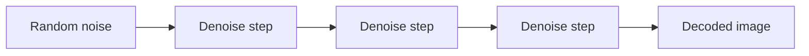

# Denoising

Denoising is the repeated process of moving from noise toward an image.

::: tip Quick Take
Diffusion generation does not create the final image in one step. It starts noisy and repeatedly predicts how to make the sample less noisy while following conditioning.
:::

## Denoising Loop

<!-- diagram id="denoising-loop" caption="Simplified denoising loop" -->

The sampler and scheduler decide how this path is taken. The model predicts what changes should move the noisy sample toward the conditioned result.

## Why Steps Matter

Too few steps can leave weak structure or rough detail. Too many steps can waste time or shift the image in unwanted ways. Useful ranges depend on the model family, sampler, scheduler, and workflow.

## What The Model Predicts

Diffusion models are trained on noisy versions of data. During training, the system learns a denoising task: given a noisy sample, a noise level, and conditioning, predict information that helps recover a cleaner sample. Depending on the model and scheduler, the prediction target may be noise, a denoised sample, velocity, or another parameterization.

For everyday use, the key idea is simpler: each step estimates a direction from "less coherent" toward "more coherent under this conditioning." The final image is the accumulated result of many approximate updates, not one perfect decision.

## Noise Levels

Early denoising steps usually operate at high noise levels. They influence broad composition, layout, silhouette, and major color areas. Later steps operate at lower noise levels. They refine texture, edges, small details, and local consistency.

This is why changing a seed can completely change composition, while small late-stage changes may only affect texture. It is also why high denoising strength in image-to-image can replace the original structure: the workflow is allowing the sample to move through a noisier, more flexible part of the process.

## Steps Are Not A Quality Slider

More steps give the sampler more opportunities to refine the sample, but they do not guarantee a better image. Once a workflow has enough steps for the chosen model and sampler, extra steps can waste time, exaggerate details, interact badly with high guidance, or produce changes that are not worth the cost.

Some newer model families are trained or distilled to work with fewer steps. Others expect longer schedules. Always treat step count as model- and sampler-dependent.

## Advanced Detail: Training And Inference Are Different

Training teaches a network to solve denoising predictions across many noise levels. Inference uses that trained network inside a numerical procedure chosen by the sampler and scheduler. The sampler decides how to use predictions; the scheduler decides which noise levels are visited and how large each update is.

This separation explains why the same checkpoint can look different under different samplers. The model is the same, but the path through denoising is different.

::: info Related Reading
For deeper implementation detail, see [Denoising](../theory/denoising.md) in the theory section and [Samplers And Schedulers](./samplers-and-schedulers.md).
:::
