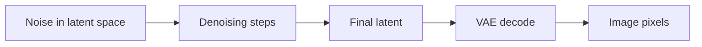

# Latent Space

Latent space is a compressed representation where many modern diffusion workflows operate.

::: tip Quick Take
Latent diffusion usually denoises a compressed representation first, then decodes it into pixels at the end.
:::

## Latent Workflow

<!-- diagram id="latent-workflow" caption="Latent diffusion workflow" -->

Working in latent space can make generation more efficient than operating directly on full-resolution pixels at every step.

::: info VAE Connection
In latent diffusion, the VAE converts between image pixels and latent representations. A mismatched VAE can affect colors, contrast, detail, or artifacts.
:::

## Why Use Latents?

Directly denoising high-resolution pixels is expensive. Latent diffusion reduces that cost by using a learned compressed representation. Instead of updating every pixel throughout the whole denoising process, the workflow updates a smaller latent tensor that still contains enough information to decode into an image.

This makes generation faster and more memory-efficient, which is one reason latent diffusion became practical for consumer GPUs. The tradeoff is that the workflow now depends on the quality and compatibility of the encoder and decoder.

## Latents Are Not Just Smaller Images

A latent is not a normal image thumbnail. It is a learned representation produced by an encoder, usually part of a variational autoencoder. Nearby values in latent space can correspond to visual structure, color, texture, and semantic information, but the channels are not directly human-readable like RGB pixels.

Because latents are learned, they carry assumptions from the training setup:

- expected scaling factors
- channel counts
- VAE architecture
- image normalization
- resolution multiples
- color and contrast behavior

Using the wrong VAE or latent scaling can produce washed-out colors, strange contrast, noisy detail, or broken decoding.

## Practical Effects

Latent-space workflows affect everyday settings:

- image dimensions often need to fit model/backend multiples
- VAE choice can change color and detail
- high-resolution generation may use latent tiling or staged refinement
- image-to-image strength controls how much noise is added to encoded latents
- upscaling can happen in latent space, pixel space, or both

## Advanced Detail: Compression Is Lossy

The VAE does not preserve every pixel perfectly. Encoding and decoding can soften fine details, alter color, or lose exact text and line art. This is usually acceptable for image generation, but it matters for workflows that need precision, such as typography, diagrams, logos, or faithful restoration.

For precision work, use workflows that combine diffusion with masks, control inputs, pixel-space editing, vector tools, or post-processing rather than expecting latent diffusion to preserve every small mark.
