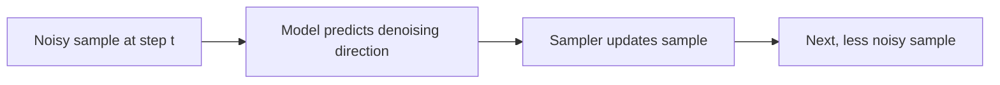

# Denoising

Diffusion models are trained to predict how to move from noisy data toward cleaner data. During generation, this learned behavior is applied repeatedly.

::: tip Quick Take
The model is not drawing the final image in one pass. It repeatedly predicts how to reduce noise while staying aligned with conditioning.
:::

## Simplified Process

<!-- diagram id="theory-denoising-step" caption="One denoising update" -->

## Why This Matters

Settings such as steps, sampler, scheduler, guidance, and seed all affect this repeated process. Small changes can compound over many steps.
