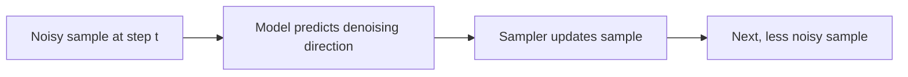

# Denoising

Diffusion models are trained to predict how to move from noisy data toward cleaner data. During generation, this learned behavior is applied repeatedly.

::: tip Quick Take
The model is not drawing the final image in one pass. It repeatedly predicts how to reduce noise while staying aligned with conditioning.
:::

## Simplified Process

<!-- diagram id="theory-denoising-step" caption="One denoising update" -->

## Why This Matters

Settings such as steps, sampler, scheduler, guidance, and seed all affect this repeated process. Small changes can compound over many steps.

## Training Objective

During training, clean images are corrupted with noise at different noise levels. The model learns to predict information that helps reverse that corruption. Depending on the architecture and scheduler, the model may predict the noise that was added, the denoised sample, velocity, or another equivalent target.

The important point is that the model learns a conditional denoising function. At inference time, generation repeatedly applies that learned function to a random starting sample while injecting conditioning from text, images, masks, adapters, or other controls.

## Inference Is A Numerical Process

The trained model does not directly output a finished image. It is called many times inside a sampler. Each call estimates what should happen at the current noise level. The sampler turns that estimate into the next sample.

This is why sampler choice matters even with the same checkpoint. The model prediction can be used in different numerical update rules, and those rules can produce different textures, convergence behavior, and stability.

## Early And Late Steps

High-noise steps tend to influence broad structure. Low-noise steps tend to refine details. This is a useful mental model, but not an exact boundary. Guidance, scheduler shape, model training, and conditioning strength can all shift how much each step affects the result.

::: warning Not A Straight Path
Denoising is not a simple linear cleanup from blurry image to sharp image. It is a trajectory through a learned distribution. Small early changes can lead to very different final images.
:::
