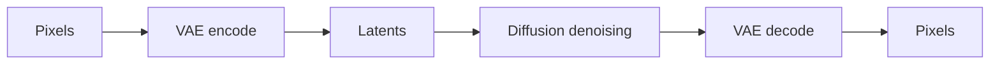

# Latent Diffusion

Latent diffusion performs denoising in a compressed representation instead of directly in pixel space.

::: tip Quick Take
The image is represented as latents during denoising, then decoded to pixels near the end of the workflow.
:::

## Latent vs Pixel Space

<!-- diagram id="latent-vs-pixel-space" caption="Latent diffusion moves between pixels and latents" -->

Latent workflows can be more efficient, but they introduce VAE compatibility as another important part of the system.

::: info Practical Consequence
If a VAE is mismatched or missing, the final decoded image may show color, contrast, or detail problems even when the denoising model is otherwise working.
:::

## The Role Of The VAE

A variational autoencoder has two practical jobs in latent diffusion:

- encode images into latents for image-to-image, inpainting, or training
- decode generated latents back into pixel images

The latent representation is smaller than the original image, but it is not just a resized picture. It is a learned feature space. The diffusion model is trained to denoise in that feature space, so the VAE and diffusion model must agree about what the latents mean.

## Why This Helps

Pixel-space diffusion at useful resolutions is expensive because every denoising step operates on a large image tensor. Latent diffusion reduces the size of the tensor being denoised, which lowers memory and compute requirements. This made high-quality image generation more practical on consumer and rented GPUs.

## Tradeoffs

Latent diffusion introduces compression artifacts and reconstruction limits. Very fine text, exact line work, small symbols, and precise geometry may be difficult because the VAE may not preserve every detail exactly.

Common practical consequences:

- decoded colors can depend on VAE choice
- fine details may need high-resolution refinement or inpainting
- tiled workflows must handle seams carefully
- image-to-image workflows depend on how the input is encoded before noise is added

## Advanced Detail: Latent Scaling

Many latent workflows use a scaling factor so latent values have a range expected by the diffusion model. If a tool mishandles scaling or mixes components trained with different latent assumptions, outputs can look low-contrast, oversaturated, noisy, or structurally wrong.

Most users do not need to set this manually, but it matters when building custom pipelines or converting models between libraries.
