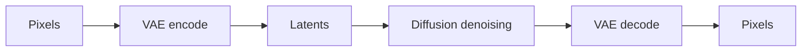

# Latent Diffusion

Latent diffusion performs denoising in a compressed representation instead of directly in pixel space.

::: tip Quick Take
The image is represented as latents during denoising, then decoded to pixels near the end of the workflow.
:::

## Latent vs Pixel Space

<!-- diagram id="latent-vs-pixel-space" caption="Latent diffusion moves between pixels and latents" -->

Latent workflows can be more efficient, but they introduce VAE compatibility as another important part of the system.

::: info Practical Consequence
If a VAE is mismatched or missing, the final decoded image may show color, contrast, or detail problems even when the denoising model is otherwise working.
:::
